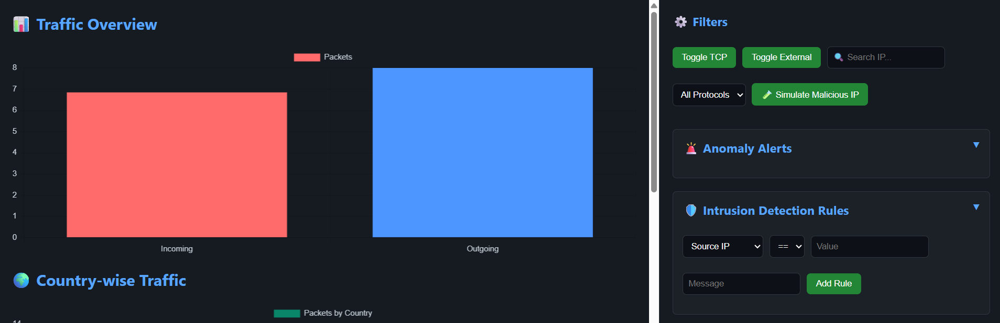
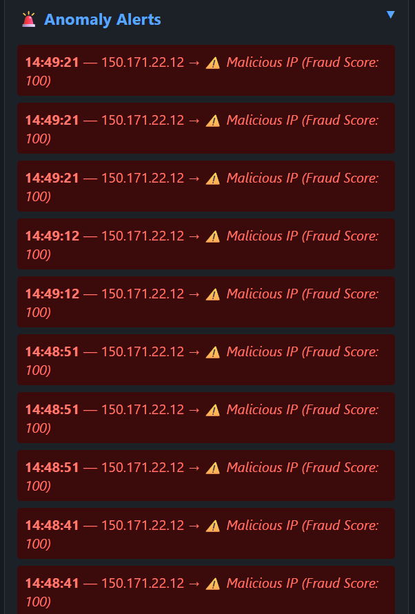
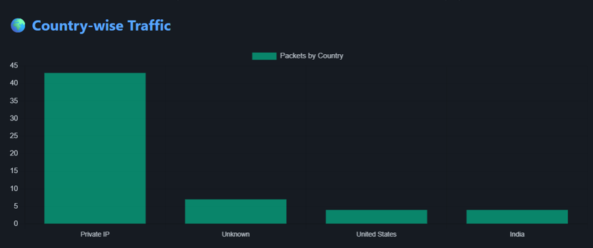
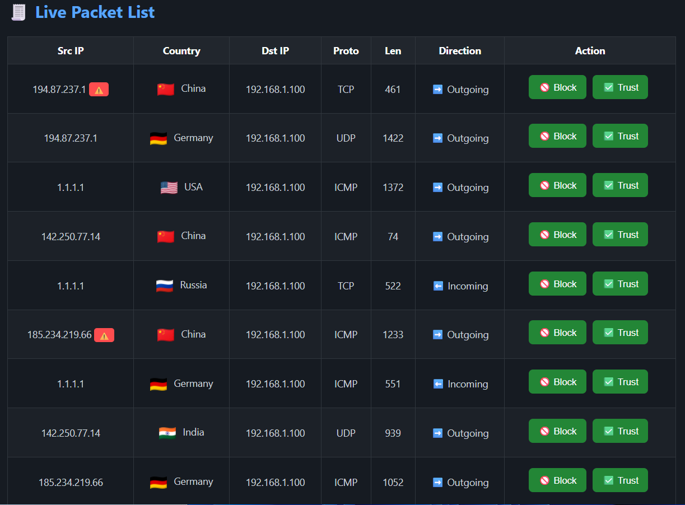
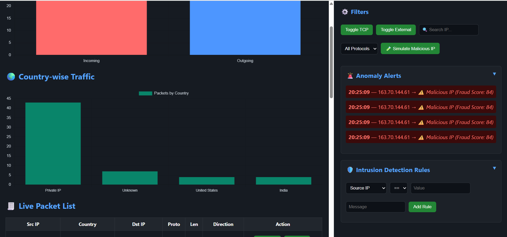
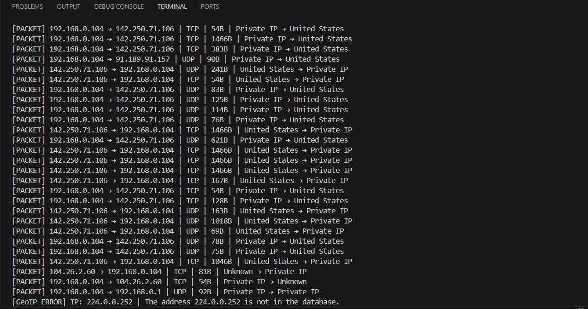

# 🛰️ NetSentinel – Real-Time Network Traffic Analyzer & Threat Detector

**NetSentinel** is a full-stack real-time network traffic analysis and threat detection system. Built using FastAPI, Scapy, WebSockets, and optional ML models, it captures, analyzes, and visualizes live network packets. GeoIP lookup, reverse DNS resolution, and alerting mechanisms make it ideal for cybersecurity monitoring and traffic profiling.

---

## 📌 Features

* 📡 Real-time packet sniffing using **Scapy**
* ⚠️ Rule-based Intrusion Detection System (IDS)
* 🧠 ML-based anomaly detection using Isolation Forest
* 🌍 GeoIP Lookup with country flags
* 🔍 Reverse DNS and protocol detection
* 📊 Live Dashboard:

  * Incoming vs Outgoing traffic charts
  * Protocol/port breakdown
  * Top 5 IP talkers
  * Country-based charts
* 🔔 Live alerts with blinking badges and replay mode
* 🌐 WebSocket-powered real-time updates
* 🐳 Docker-ready backend (optional)

---

## 📁 Directory Structure

```bash
NetSentinel/
├── app/
│   ├── dashboard.py        # Dashboard logic
│   ├── detector.py         # ML-based anomaly detection
│   ├── geoip.py            # GeoIP and flag lookups
│   ├── ids.py              # Rule-based IDS
│   ├── sniffer.py          # Packet sniffing via Scapy
│   ├── store.py            # Global in-memory store
│   ├── websocket.py        # WebSocket event handlers
│   └── utils.py            # Common helper functions
├── data/
│   ├── GeoLite2-City.mmdb  # GeoIP database
│   └── normal_traffic.csv  # ML training data
├── models/
│   └── isolation_model.pkl # Trained ML model
├── ml_model/
│   └── train_model.py      # ML model training script
├── static/
│   ├── dashboard.html      # Frontend UI
│   ├── css/
│   └── js/
├── test.py                 # Basic test script
├── main.py                 # FastAPI app entry point
├── requirements.txt
├── simulate_traffic.py     # Generate mock packet traffic
├── check_interfaces.py     # Interface utility
├── trusted_ips.txt         # Whitelisted IPs
├── docker-compose.yml
└── README.md
```

---

## 🧠 Model Architecture (Anomaly Detection + GeoIP)

NetSentinel integrates a modular, multi-layered architecture combining real-time packet sniffing, machine learning–based anomaly detection, GeoIP analysis, and WebSocket-based UI updates.

### 🌍 1. GeoIP Lookup (MaxMind)

* Maps external IPs to:

  * Country name
  * ISO code
  * Coordinates
* Powered by `GeoLite2-City.mmdb` placed in `data/`

```python
geo_reader = geoip2.database.Reader('data/GeoLite2-City.mmdb')
```

---

### 🧠 2. ML-Based Anomaly Detection (Isolation Forest)

* Trained on `normal_traffic.csv`
* Scikit-learn Isolation Forest model
* Output: `1` (normal), `-1` (anomaly)

```python
from sklearn.ensemble import IsolationForest
model = IsolationForest()
model.fit(normal_data)
pred = model.predict(features)
```

Model saved as `models/isolation_model.pkl`

---

### ⚠️ 3. Rule-Based IDS (Always-On)

* Detects:

  * Suspicious ports
  * External traffic to internal IPs
  * DNS tunneling & malformed HTTP

Defined in `app/ids.py`

---

### 🔁 4. Packet Sniffer

* Scapy-based live capture:

  * TCP / UDP / ICMP / DNS / HTTP

```python
from scapy.all import sniff, IP, TCP, UDP, DNS
```

---

### 🌐 5. WebSocket Live Dashboard

* FastAPI backend, frontend updates via WebSocket
* Sends:

  * Packet metadata
  * GeoIP info
  * Threat alerts

---

### 🧪 6. Simulated Traffic Generator

* Generates test traffic (TCP/UDP)
* Useful for testing live graphs & detection

```bash
python simulate_traffic.py
```

---

### 🔌 Architecture Flow

```
Network
  ↓
Sniffer (Scapy)
  ↓
GeoIP Lookup
  ↓            ↓
Rule Engine   ML Detector (Isolation Forest)
  ↓
Threat/Normal?
  ↓
WebSocket Push
  ↓
Live Dashboard (JS/HTML)
```


## 🧠 Tech Stack & Tools Used


| Layer         | Technology / Tool        |
|---------------|---------------------------|
| Packet Capture| Scapy                     |
| Backend API   | FastAPI, WebSocket        |
| Anomaly Model | Isolation Forest (sklearn)|
| GeoIP Lookup  | MaxMind GeoLite2          |
| Frontend      | HTML, JavaScript, Chart.js|
| Deployment    | Docker (optional)         |

---
# 📡 NetSentinel — Real-Time Network Traffic Analyzer & Threat Detector

[](https://netsentinel-production-1f12.up.railway.app/)

NetSentinel is a real-time full-stack traffic monitoring and intrusion detection system...

## 🚀 Live Deployment

NetSentinel is live and running with simulated packet traffic on Railway.

🔗 Try it here:  
👉 [https://netsentinel-production-1f12.up.railway.app/](https://netsentinel-production-1f12.up.railway.app/)


## 🚀 Installation & Local Setup

### 1️⃣ Clone the repository

```bash
git clone https://github.com/Vaibhav06Jha28/netsentinel.git
cd netsentinel
```

### 2️⃣ Create and activate virtual environment

```bash
python -m venv venv
source venv/bin/activate  # On Windows: venv\Scripts\activate
```

### 3️⃣ Install dependencies

```bash
pip install -r requirements.txt
```

### 4️⃣ Place GeoIP database

Download **GeoLite2-City.mmdb** from MaxMind
Place it in the `data/` directory

### 5️⃣ (Optional) Retrain ML model

```bash
python ml_model/train_model.py
```

---

## ▶️ Run the Project

```bash
uvicorn main:app --reload
```

Open your browser at:
**[http://localhost:8000/static/dashboard.html](http://localhost:8000/static/dashboard.html)**

---

## 🧪 Testing & Simulation

```bash
# Simulate traffic
python simulate_traffic.py

# Check available network interfaces
python check_interfaces.py

# Run test script
python test.py
```

---

## 🌐 WebSocket Info

**Live packet stream:**
`ws://localhost:8000/ws/live`

Sample Output:

```json
{
  "timestamp": "2025-07-05T19:00:00",
  "src_ip": "192.168.1.10",
  "dst_ip": "8.8.8.8",
  "protocol": "TCP",
  "country": "India",
  "hostname": "dns.google",
  "threat": false
}
```

---

## 🐳 Docker Deployment (Optional)

```bash
docker-compose up --build
```

Edit `docker-compose.yml` for port/mount settings.

---

## 🖼️ Demo Screenshots

### 📊 Real-Time Dashboard


### 🔔 Alert System


### 🌍 Country-wise IP Chart


### 🧠 Familiar IP Recognition


### 🛰️ GeoIP Detection


### 🌐 Interface Monitor


### 📡 Live IP Stream



---

## ✨ Future Improvements

* 🌐 User authentication & login roles
* 📦 MongoDB/Redis integration for packet logs
* 📉 Replay traffic viewer
* ☁️ Cloud-based visualization (Render/GCP)
* 🔁 Live packet replay / export to CSV

---

## 👨‍💻 Developed By

**Vaibhav Jha**
Final-Year Computer Engineering Student
🔗 [LinkedIn](https://www.linkedin.com/in/vaibhav-jha-27191b1ba/)
⭐ Star this repo if it helped you!

---

## 📄 License

This project is licensed under the **MIT License**. See the [LICENSE](LICENSE) file for details.
